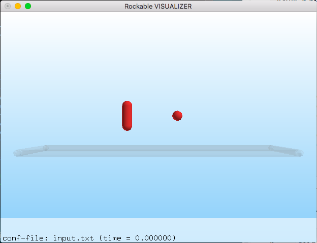

## Hello World for Rockable 

To make our first simulation with `Rockable`, 2 text-files are needed: `input.txt` for setting the system, and `shapes.shp` that defines the sphero-polyedron shapes.

Here is what `input.txt`, that is a so-called **conf-file**, looks like:

```
Rockable 29-11-2018

#### time #############################
t 0
tmax 2.0
dt 1e-6
interVerlet 0.01
interConf 0.05

#### proximity of the particles #######
DVerlet 0.08
dVerlet 0.02

#### properties for particles #########
density 0 2700
density 1 2700

#### interaction model ################
forceLaw Avalanches

#### interaction parameters ###########
knContact 0 1 1e6
en2Contact 0 1 0.2
ktContact 0 1 1e7
muContact 0 1 0.9
krContact 0 1 1e7
murContact 0 1 0.0

#### the system #######################
iconf 0
nDriven 1
shapeFile shapes.shp
Particles 3
Plan 0 0 1.0   0 -0.05 0   0 0 0   0 0 0   1 0 0 0   0 0 0   0 0 0
Rice 1 0 1.0   -0.5 0.5 0   0 0 0   0 0 0   0.707 0 0.707 0   0 0 -10   0 0 0
Sphere 1 0 1.0   0.3 0.5 0   0 0 0   0 0 0   1 0 0 0   0 0 0   0 0 0
```

A conf-file defines the format that `Rockable` is able to understand. It is used as input configuration, and also as stored configuration (periodically saved in the simulation flow). The definition of this format is documented [here](https://richefeu.gitbook.io/cdm/dem/format-of-configuration-files-conf-files).

The shape file to be used is stated in the input file with the keyword `shapeFile` followed with the name of the file. Here is the shape-file defined in the hello-world example:

```
<
name Sphere
radius 0.08
preCompDone y
nv 1
0 0 0
ne 0
nf 0
obb.extent 0.08 0.08 0.08
obb.e1 1 0 0
obb.e2 0 1 0
obb.e3 0 0 1
obb.center 0 0 0
volume 0.002144660584851
I/m 0.00256 0.00256 0.00256
>

<
name Rice
radius 0.08
preCompDone n
nv 3
0 -0.16 0
0 0 0
0 0.16 0
ne 2
0 1
1 2
nf 0
obb.extent 0.08 0.24 0.08
obb.e1 1 0 0
obb.e2 0 1 0
obb.e3 0 0 1
obb.center 0 0 0
volume 0.008578642339403
I/m 0.00493333 0.00493333 0.0032
>
```

We can notice the definition of 3 particle shapes, each defined into brackets `< ... >`. The documentation can be found [here](https://richefeu.gitbook.io/cdm/dem/syntax-for-shape-files).

### Running and visualising a simulation

Since the file `input.txt` is a conf-file, it can be visualised by using the application `see`. If `see` has been successfully compiled in the folder `src`, it can be invoked that way in the current location:

```
../../src/see input.txt
```

As a result, a window will appear and it will be possible to inspect the system. This can be useful for checking the system before running a simulation.




To run a simulation with what is defined in `input.txt`, type:

```
../../src/run input.txt
```

After a few seconds, hundred files named `confXXX` will have been created (`XXX` ranges from 0 to 40). To see them, simply invoke `see` without argument. the navigation from one file to another is done with the `+` and `-` keys. The mouse usage is explained when typing the key `h`, and keyboard shortcuts are obtained by typing `k`. 